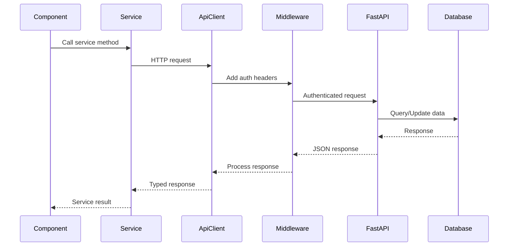

# ATSPro API Integration Patterns

## Overview

This document defines standardized patterns for integrating the ATSPro Next.js frontend with the FastAPI backend, ensuring consistent error handling, authentication, and data flow across the application.

## API Client Architecture

### Request/Response Flow



## Authentication Integration

### Token Management Pattern

```typescript
interface AuthTokens {
  access_token: string;
  refresh_token: string;
  token_type: 'bearer';
  expires_in: number;
  expires_at: number;
}

class AuthTokenManager {
  private static instance: AuthTokenManager;
  private tokens: AuthTokens | null = null;
  private refreshPromise: Promise<AuthTokens> | null = null;

  static getInstance(): AuthTokenManager {
    if (!AuthTokenManager.instance) {
      AuthTokenManager.instance = new AuthTokenManager();
    }
    return AuthTokenManager.instance;
  }

  setTokens(tokens: AuthTokens): void {
    this.tokens = {
      ...tokens,
      expires_at: Date.now() + (tokens.expires_in * 1000)
    };
    this.storeTokens();
  }

  getAccessToken(): string | null {
    return this.tokens?.access_token || null;
  }

  async getValidAccessToken(): Promise<string | null> {
    if (!this.tokens) {
      return null;
    }

    // Check if token expires in next 5 minutes
    if (this.tokens.expires_at - Date.now() < 300000) {
      try {
        await this.refreshTokens();
      } catch (error) {
        this.clearTokens();
        return null;
      }
    }

    return this.tokens.access_token;
  }

  private async refreshTokens(): Promise<AuthTokens> {
    if (this.refreshPromise) {
      return this.refreshPromise;
    }

    if (!this.tokens?.refresh_token) {
      throw new Error('No refresh token available');
    }

    this.refreshPromise = this.performRefresh();
    
    try {
      const newTokens = await this.refreshPromise;
      this.setTokens(newTokens);
      return newTokens;
    } finally {
      this.refreshPromise = null;
    }
  }

  private async performRefresh(): Promise<AuthTokens> {
    const response = await fetch('/api/auth/refresh', {
      method: 'POST',
      headers: { 'Content-Type': 'application/json' },
      body: JSON.stringify({
        refresh_token: this.tokens?.refresh_token
      })
    });

    if (!response.ok) {
      throw new Error('Token refresh failed');
    }

    return response.json();
  }

  private storeTokens(): void {
    if (this.tokens) {
      localStorage.setItem('auth_tokens', JSON.stringify(this.tokens));
    }
  }

  private loadTokens(): void {
    try {
      const stored = localStorage.getItem('auth_tokens');
      if (stored) {
        this.tokens = JSON.parse(stored);
      }
    } catch (error) {
      this.clearTokens();
    }
  }

  clearTokens(): void {
    this.tokens = null;
    localStorage.removeItem('auth_tokens');
  }
}
```

### Authenticated API Client

```typescript
class AuthenticatedApiClient extends ApiClientImpl {
  private tokenManager: AuthTokenManager;

  constructor(baseURL: string) {
    super(baseURL);
    this.tokenManager = AuthTokenManager.getInstance();
  }

  protected async request<T>(
    method: string,
    url: string,
    data?: any,
    config?: RequestConfig
  ): Promise<ApiResponse<T>> {
    // Add authentication headers
    const token = await this.tokenManager.getValidAccessToken();
    const headers = {
      ...config?.headers,
      ...(token && { Authorization: `Bearer ${token}` })
    };

    const response = await super.request<T>(method, url, data, {
      ...config,
      headers
    });

    // Handle authentication errors
    if (response.errors?.some(error => 
      error.includes('unauthorized') || 
      error.includes('invalid token')
    )) {
      this.tokenManager.clearTokens();
      // Redirect to login or emit auth error event
      window.dispatchEvent(new CustomEvent('auth:required'));
    }

    return response;
  }
}
```

## Error Handling Patterns

### Standardized Error Response Format

```typescript
// API Error Response (from FastAPI)
interface ApiErrorDetail {
  type: string;
  loc: (string | number)[];
  msg: string;
  input?: any;
}

interface ApiErrorResponse {
  detail: string | ApiErrorDetail[];
  error_code?: string;
  error_type?: string;
}

// Service Error Transformation
class ErrorTransformer {
  static transformApiError(apiResponse: ApiErrorResponse): ServiceError {
    if (typeof apiResponse.detail === 'string') {
      return new ServiceError(
        this.mapErrorType(apiResponse.error_type),
        apiResponse.detail,
        apiResponse.error_code || 'UNKNOWN_ERROR'
      );
    }

    // Handle validation errors
    if (Array.isArray(apiResponse.detail)) {
      const validationErrors = apiResponse.detail.map(detail => 
        `${detail.loc.join('.')}: ${detail.msg}`
      );
      
      return new ServiceError(
        ServiceErrorType.VALIDATION_ERROR,
        'Validation failed',
        'VALIDATION_ERROR',
        validationErrors
      );
    }

    return new ServiceError(
      ServiceErrorType.SERVER_ERROR,
      'Unknown server error',
      'UNKNOWN_ERROR'
    );
  }

  private static mapErrorType(errorType?: string): ServiceErrorType {
    switch (errorType) {
      case 'authentication_error':
        return ServiceErrorType.AUTHENTICATION_ERROR;
      case 'authorization_error':
        return ServiceErrorType.AUTHORIZATION_ERROR;
      case 'validation_error':
        return ServiceErrorType.VALIDATION_ERROR;
      case 'not_found':
        return ServiceErrorType.NOT_FOUND;
      default:
        return ServiceErrorType.SERVER_ERROR;
    }
  }
}
```

### Retry Logic with Exponential Backoff

```typescript
interface RetryConfig {
  maxRetries: number;
  baseDelay: number;
  maxDelay: number;
  backoffFactor: number;
  retryableErrors: ServiceErrorType[];
}

class RetryableApiClient extends AuthenticatedApiClient {
  private retryConfig: RetryConfig = {
    maxRetries: 3,
    baseDelay: 1000,
    maxDelay: 30000,
    backoffFactor: 2,
    retryableErrors: [
      ServiceErrorType.NETWORK_ERROR,
      ServiceErrorType.TIMEOUT_ERROR,
      ServiceErrorType.SERVER_ERROR
    ]
  };

  protected async request<T>(
    method: string,
    url: string,
    data?: any,
    config?: RequestConfig
  ): Promise<ApiResponse<T>> {
    return this.executeWithRetry(
      () => super.request<T>(method, url, data, config),
      config?.retries ?? this.retryConfig.maxRetries
    );
  }

  private async executeWithRetry<T>(
    operation: () => Promise<ApiResponse<T>>,
    retriesLeft: number
  ): Promise<ApiResponse<T>> {
    try {
      const result = await operation();
      
      if (result.success || retriesLeft === 0) {
        return result;
      }

      // Check if error is retryable
      if (result.errors?.length) {
        const error = ErrorTransformer.transformApiError({
          detail: result.errors[0],
          error_code: 'OPERATION_FAILED'
        });

        if (!this.retryConfig.retryableErrors.includes(error.type)) {
          return result;
        }
      }

      // Wait before retry
      const delay = this.calculateDelay(this.retryConfig.maxRetries - retriesLeft);
      await this.sleep(delay);

      return this.executeWithRetry(operation, retriesLeft - 1);
    } catch (error) {
      if (retriesLeft === 0) {
        throw error;
      }

      const delay = this.calculateDelay(this.retryConfig.maxRetries - retriesLeft);
      await this.sleep(delay);

      return this.executeWithRetry(operation, retriesLeft - 1);
    }
  }

  private calculateDelay(attempt: number): number {
    const delay = this.retryConfig.baseDelay * 
                  Math.pow(this.retryConfig.backoffFactor, attempt);
    return Math.min(delay, this.retryConfig.maxDelay);
  }

  private sleep(ms: number): Promise<void> {
    return new Promise(resolve => setTimeout(resolve, ms));
  }
}
```

## Data Validation Patterns

### Request/Response Schema Validation

```typescript
import { z } from 'zod';

// Zod schemas matching Pydantic models
const ContactInfoSchema = z.object({
  full_name: z.string().min(1),
  email: z.string().email().optional(),
  phone: z.string().optional(),
  address: z.string().optional(),
  links: z.array(z.object({
    name: z.string(),
    url: z.string().url()
  })).default([])
});

const ResumeSchema = z.object({
  contact_info: ContactInfoSchema,
  summary: z.string().optional(),
  work_experience: z.array(z.object({
    company: z.string(),
    position: z.string(),
    start_date: z.string().optional(),
    end_date: z.string().optional(),
    is_current: z.boolean().optional(),
    description: z.string().optional(),
    responsibilities: z.array(z.string()).default([]),
    skills: z.array(z.string()).default([])
  })).default([]),
  education: z.array(z.object({
    institution: z.string(),
    degree: z.string(),
    field_of_study: z.string().optional(),
    graduation_date: z.string().optional(),
    gpa: z.number().optional(),
    honors: z.array(z.string()).default([]),
    relevant_courses: z.array(z.string()).default([]),
    skills: z.array(z.string()).default([])
  })).default([]),
  certifications: z.array(z.object({
    name: z.string(),
    issuer: z.string(),
    date_obtained: z.string().optional(),
    expiration_date: z.string().optional(),
    credential_id: z.string().optional()
  })).default([]),
  skills: z.array(z.string()).default([])
});

// Validation helper
class ValidationHelper {
  static validateRequest<T>(schema: z.ZodSchema<T>, data: unknown): T {
    try {
      return schema.parse(data);
    } catch (error) {
      if (error instanceof z.ZodError) {
        throw new ServiceError(
          ServiceErrorType.VALIDATION_ERROR,
          'Request validation failed',
          'VALIDATION_ERROR',
          error.errors.map(e => `${e.path.join('.')}: ${e.message}`)
        );
      }
      throw error;
    }
  }

  static validateResponse<T>(schema: z.ZodSchema<T>, data: unknown): T {
    try {
      return schema.parse(data);
    } catch (error) {
      if (error instanceof z.ZodError) {
        console.warn('Response validation failed:', error.errors);
        // In production, you might want to report this to monitoring
      }
      return data as T; // Return raw data if validation fails
    }
  }
}
```

### Service Implementation with Validation

```typescript
class ResumeServiceImpl extends BaseServiceImpl implements ResumeService {
  async updateResume(resumeData: Resume): Promise<ApiResponse<ResumeVersion>> {
    // Validate input
    const validatedData = ValidationHelper.validateRequest(ResumeSchema, resumeData);
    
    const response = await this.apiClient.put<ResumeVersion>(
      '/api/resume',
      validatedData
    );

    if (response.success && response.data) {
      // Validate response
      response.data = ValidationHelper.validateResponse(
        ResumeVersionSchema,
        response.data
      );
    }

    return response;
  }

  async uploadResume(file: File): Promise<ApiResponse<Resume>> {
    // Validate file
    if (!this.isValidResumeFile(file)) {
      throw new ServiceError(
        ServiceErrorType.VALIDATION_ERROR,
        'Invalid file type. Only PDF, DOC, and DOCX files are allowed.',
        'INVALID_FILE_TYPE'
      );
    }

    const response = await this.apiClient.upload<Resume>(
      '/api/parse',
      file
    );

    if (response.success && response.data) {
      response.data = ValidationHelper.validateResponse(
        ResumeSchema,
        response.data
      );
    }

    return response;
  }

  private isValidResumeFile(file: File): boolean {
    const allowedTypes = [
      'application/pdf',
      'application/msword',
      'application/vnd.openxmlformats-officedocument.wordprocessingml.document'
    ];
    const maxSize = 10 * 1024 * 1024; // 10MB

    return allowedTypes.includes(file.type) && file.size <= maxSize;
  }
}
```

## Caching Strategies

### Multi-Level Caching

```typescript
interface CacheConfig {
  ttl: number;
  maxSize: number;
  strategy: 'lru' | 'fifo' | 'ttl';
}

class MultiLevelCache {
  private memoryCache: Map<string, CacheEntry>;
  private config: CacheConfig;

  constructor(config: CacheConfig) {
    this.config = config;
    this.memoryCache = new Map();
  }

  async get<T>(key: string): Promise<T | null> {
    // Check memory cache first
    const memoryResult = this.getFromMemory<T>(key);
    if (memoryResult) {
      return memoryResult;
    }

    // Check localStorage cache
    const localResult = this.getFromLocalStorage<T>(key);
    if (localResult) {
      // Promote to memory cache
      this.setInMemory(key, localResult, this.config.ttl);
      return localResult;
    }

    return null;
  }

  async set<T>(key: string, value: T, ttl?: number): Promise<void> {
    const actualTtl = ttl ?? this.config.ttl;
    
    // Set in memory cache
    this.setInMemory(key, value, actualTtl);
    
    // Set in localStorage for persistence
    this.setInLocalStorage(key, value, actualTtl);
  }

  private getFromMemory<T>(key: string): T | null {
    const entry = this.memoryCache.get(key);
    if (!entry) return null;

    if (Date.now() > entry.expires) {
      this.memoryCache.delete(key);
      return null;
    }

    return entry.value as T;
  }

  private setInMemory<T>(key: string, value: T, ttl: number): void {
    this.memoryCache.set(key, {
      value,
      expires: Date.now() + ttl,
      size: JSON.stringify(value).length
    });

    this.evictIfNeeded();
  }

  private getFromLocalStorage<T>(key: string): T | null {
    try {
      const stored = localStorage.getItem(`cache:${key}`);
      if (!stored) return null;

      const entry = JSON.parse(stored);
      if (Date.now() > entry.expires) {
        localStorage.removeItem(`cache:${key}`);
        return null;
      }

      return entry.value as T;
    } catch {
      return null;
    }
  }

  private setInLocalStorage<T>(key: string, value: T, ttl: number): void {
    try {
      const entry = {
        value,
        expires: Date.now() + ttl
      };
      localStorage.setItem(`cache:${key}`, JSON.stringify(entry));
    } catch {
      // Handle localStorage quota exceeded
    }
  }

  private evictIfNeeded(): void {
    if (this.memoryCache.size <= this.config.maxSize) return;

    // Implement LRU eviction
    const entries = Array.from(this.memoryCache.entries())
      .sort((a, b) => a[1].expires - b[1].expires);

    const toRemove = entries.slice(0, entries.length - this.config.maxSize);
    toRemove.forEach(([key]) => this.memoryCache.delete(key));
  }
}

interface CacheEntry {
  value: any;
  expires: number;
  size: number;
}
```

## Real-time Updates

### Server-Sent Events Integration

```typescript
interface SSEConfig {
  url: string;
  retryDelay: number;
  maxRetries: number;
  heartbeatInterval: number;
}

class SSEClient {
  private eventSource: EventSource | null = null;
  private config: SSEConfig;
  private listeners: Map<string, Set<(data: any) => void>>;
  private retryCount = 0;

  constructor(config: SSEConfig) {
    this.config = config;
    this.listeners = new Map();
  }

  async connect(): Promise<void> {
    if (this.eventSource) {
      return;
    }

    const token = await AuthTokenManager.getInstance().getValidAccessToken();
    const url = `${this.config.url}?token=${token}`;

    this.eventSource = new EventSource(url);

    this.eventSource.onopen = () => {
      this.retryCount = 0;
    };

    this.eventSource.onmessage = (event) => {
      this.handleMessage(event);
    };

    this.eventSource.onerror = () => {
      this.handleError();
    };

    // Set up heartbeat
    this.setupHeartbeat();
  }

  disconnect(): void {
    if (this.eventSource) {
      this.eventSource.close();
      this.eventSource = null;
    }
  }

  subscribe(eventType: string, handler: (data: any) => void): void {
    if (!this.listeners.has(eventType)) {
      this.listeners.set(eventType, new Set());
    }
    this.listeners.get(eventType)!.add(handler);
  }

  unsubscribe(eventType: string, handler: (data: any) => void): void {
    const handlers = this.listeners.get(eventType);
    if (handlers) {
      handlers.delete(handler);
    }
  }

  private handleMessage(event: MessageEvent): void {
    try {
      const data = JSON.parse(event.data);
      const handlers = this.listeners.get(data.type);
      
      if (handlers) {
        handlers.forEach(handler => handler(data.payload));
      }
    } catch (error) {
      console.warn('Failed to parse SSE message:', error);
    }
  }

  private handleError(): void {
    if (this.retryCount < this.config.maxRetries) {
      this.retryCount++;
      setTimeout(() => {
        this.eventSource = null;
        this.connect();
      }, this.config.retryDelay * this.retryCount);
    }
  }

  private setupHeartbeat(): void {
    setInterval(() => {
      if (this.eventSource?.readyState === EventSource.CLOSED) {
        this.handleError();
      }
    }, this.config.heartbeatInterval);
  }
}
```

## Rate Limiting & Throttling

### Client-Side Rate Limiting

```typescript
interface RateLimitConfig {
  windowMs: number;
  maxRequests: number;
}

class RateLimiter {
  private requests: Map<string, number[]> = new Map();
  private config: RateLimitConfig;

  constructor(config: RateLimitConfig) {
    this.config = config;
  }

  canMakeRequest(key: string): boolean {
    const now = Date.now();
    const requests = this.requests.get(key) || [];
    
    // Remove old requests outside the window
    const validRequests = requests.filter(
      time => now - time < this.config.windowMs
    );

    // Check if under limit
    if (validRequests.length >= this.config.maxRequests) {
      return false;
    }

    // Record this request
    validRequests.push(now);
    this.requests.set(key, validRequests);
    
    return true;
  }

  getResetTime(key: string): number {
    const requests = this.requests.get(key) || [];
    if (requests.length === 0) return 0;
    
    const oldestRequest = Math.min(...requests);
    return oldestRequest + this.config.windowMs;
  }
}

// Rate-limited API client
class RateLimitedApiClient extends RetryableApiClient {
  private rateLimiter: RateLimiter;

  constructor(baseURL: string) {
    super(baseURL);
    this.rateLimiter = new RateLimiter({
      windowMs: 60000, // 1 minute
      maxRequests: 100  // 100 requests per minute
    });
  }

  protected async request<T>(
    method: string,
    url: string,
    data?: any,
    config?: RequestConfig
  ): Promise<ApiResponse<T>> {
    const rateLimitKey = `${method}:${url}`;
    
    if (!this.rateLimiter.canMakeRequest(rateLimitKey)) {
      const resetTime = this.rateLimiter.getResetTime(rateLimitKey);
      const waitTime = resetTime - Date.now();
      
      throw new ServiceError(
        ServiceErrorType.TIMEOUT_ERROR,
        `Rate limit exceeded. Try again in ${Math.ceil(waitTime / 1000)} seconds`,
        'RATE_LIMIT_EXCEEDED',
        { resetTime, waitTime }
      );
    }

    return super.request<T>(method, url, data, config);
  }
}
```

## Implementation Checklist

### API Client Setup
- [ ] Configure base API client with authentication
- [ ] Implement token management with refresh logic
- [ ] Add retry logic with exponential backoff
- [ ] Set up rate limiting
- [ ] Configure request/response validation

### Service Layer
- [ ] Implement all service interfaces
- [ ] Add comprehensive error handling
- [ ] Configure caching strategies
- [ ] Set up real-time updates (SSE)
- [ ] Add service factory and DI container

### Testing Strategy
- [ ] Unit tests for all service methods
- [ ] Integration tests for API endpoints
- [ ] Error scenario testing
- [ ] Authentication flow testing
- [ ] Rate limiting validation

### Monitoring & Observability
- [ ] Add request/response logging
- [ ] Implement performance metrics
- [ ] Set up error tracking
- [ ] Configure health checks
- [ ] Add usage analytics

### Security Measures
- [ ] Validate all inputs
- [ ] Sanitize responses
- [ ] Secure token storage
- [ ] Implement CSRF protection
- [ ] Add request signing (if needed)