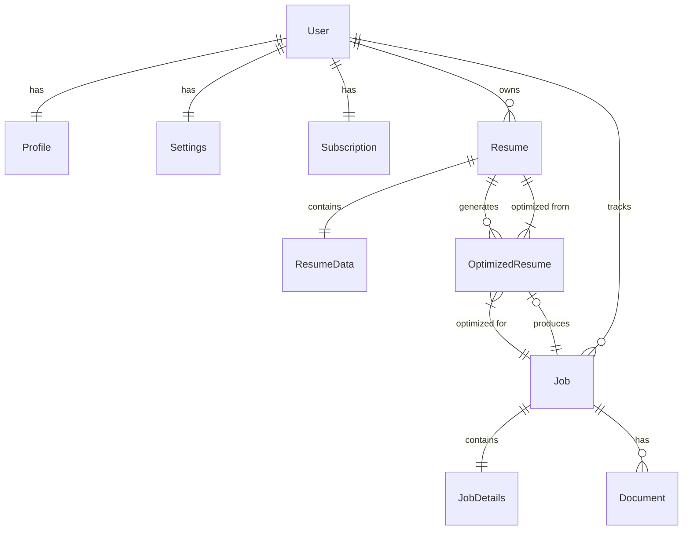

# ATSPro Data Model & Database Architecture

## Overview

ATSPro uses a multi-database architecture optimized for different data types:
- **PostgreSQL**: User profiles, authentication, settings, subscriptions, transactional data
- **ArangoDB**: Document storage with graph relationships for resumes, jobs, and documents
- **Redis**: Session management, caching, job queues

## Entity Relationship Diagram



## PostgreSQL Schema (Relational Data)

### Better-Auth Tables (Already Exists)
The authentication system uses better-auth which provides these tables:

```sql
-- Better-Auth user table (already created)
CREATE TABLE "user" (
    "id" TEXT NOT NULL PRIMARY KEY,
    "name" TEXT NOT NULL,
    "email" TEXT NOT NULL UNIQUE,
    "emailVerified" BOOLEAN NOT NULL,
    "image" TEXT,
    "createdAt" TIMESTAMP NOT NULL,
    "updatedAt" TIMESTAMP NOT NULL
);

-- Better-Auth session table (already created)
CREATE TABLE "session" (
    "id" TEXT NOT NULL PRIMARY KEY,
    "expiresAt" TIMESTAMP NOT NULL,
    "token" TEXT NOT NULL UNIQUE,
    "createdAt" TIMESTAMP NOT NULL,
    "updatedAt" TIMESTAMP NOT NULL,
    "ipAddress" TEXT,
    "userAgent" TEXT,
    "userId" TEXT NOT NULL REFERENCES "user" ("id")
);

-- Better-Auth account table (already created)
CREATE TABLE "account" (
    "id" TEXT NOT NULL PRIMARY KEY,
    "accountId" TEXT NOT NULL,
    "providerId" TEXT NOT NULL,
    "userId" TEXT NOT NULL REFERENCES "user" ("id"),
    "accessToken" TEXT,
    "refreshToken" TEXT,
    "idToken" TEXT,
    "accessTokenExpiresAt" TIMESTAMP,
    "refreshTokenExpiresAt" TIMESTAMP,
    "scope" TEXT,
    "password" TEXT,
    "createdAt" TIMESTAMP NOT NULL,
    "updatedAt" TIMESTAMP NOT NULL
);

-- Better-Auth verification table (already created)
CREATE TABLE "verification" (
    "id" TEXT NOT NULL PRIMARY KEY,
    "identifier" TEXT NOT NULL,
    "value" TEXT NOT NULL,
    "expiresAt" TIMESTAMP NOT NULL,
    "createdAt" TIMESTAMP,
    "updatedAt" TIMESTAMP
);
```

### Additional ATSPro Tables

#### Profiles Table (Extended User Information)
```sql
CREATE TABLE profiles (
    id TEXT PRIMARY KEY DEFAULT gen_random_uuid()::text,
    user_id TEXT REFERENCES "user"(id) ON DELETE CASCADE,
    phone VARCHAR(50),
    location TEXT,
    title VARCHAR(255),
    bio TEXT,
    created_at TIMESTAMP DEFAULT CURRENT_TIMESTAMP,
    updated_at TIMESTAMP DEFAULT CURRENT_TIMESTAMP
);
```

#### Settings Table
```sql
CREATE TABLE settings (
    id TEXT PRIMARY KEY DEFAULT gen_random_uuid()::text,
    user_id TEXT REFERENCES "user"(id) ON DELETE CASCADE,
    theme VARCHAR(20) DEFAULT 'light',
    notifications JSONB DEFAULT '{}',
    preferences JSONB DEFAULT '{}',
    created_at TIMESTAMP DEFAULT CURRENT_TIMESTAMP,
    updated_at TIMESTAMP DEFAULT CURRENT_TIMESTAMP
);
```

#### Subscriptions Table
```sql
CREATE TABLE subscriptions (
    id TEXT PRIMARY KEY DEFAULT gen_random_uuid()::text,
    user_id TEXT REFERENCES "user"(id) ON DELETE CASCADE,
    plan VARCHAR(50) NOT NULL,
    status VARCHAR(20) DEFAULT 'active',
    starts_at TIMESTAMP NOT NULL,
    ends_at TIMESTAMP,
    auto_renew BOOLEAN DEFAULT true,
    stripe_subscription_id VARCHAR(255),
    created_at TIMESTAMP DEFAULT CURRENT_TIMESTAMP,
    updated_at TIMESTAMP DEFAULT CURRENT_TIMESTAMP
);
```

## ArangoDB Schema (Document & Graph Data)

### Document Collections

#### resumes Collection
```json
{
  "_key": "user_id",
  "_id": "resumes/user_id",
  "user_id": "text_id_from_better_auth",
  "version": 1,
  "is_active": true,
  "resume_data": {
    "contact_info": {
      "full_name": "string",
      "email": "string",
      "phone": "string", 
      "address": "string",
      "links": [{"name": "string", "url": "string"}]
    },
    "summary": "string",
    "work_experience": [{
      "company": "string",
      "position": "string",
      "start_date": "string",
      "end_date": "string",
      "is_current": boolean,
      "description": "string",
      "responsibilities": ["string"],
      "skills": ["string"]
    }],
    "education": [{
      "institution": "string",
      "degree": "string",
      "field_of_study": "string",
      "graduation_date": "string",
      "gpa": number,
      "honors": ["string"],
      "relevant_courses": ["string"],
      "skills": ["string"]
    }],
    "certifications": [{
      "name": "string",
      "issuer": "string",
      "date_obtained": "string",
      "expiration_date": "string",
      "credential_id": "string"
    }],
    "skills": ["string"]
  },
  "created_at": "timestamp",
  "updated_at": "timestamp"
}
```

#### jobs Collection
```json
{
  "_key": "generated_id",
  "_id": "jobs/generated_id",
  "user_id": "text_id_from_better_auth",
  "title": "string",
  "company": "string",
  "status": "saved|applied|interviewing|rejected|offered",
  "job_details": {
    "company": "string",
    "title": "string", 
    "description": "string",
    "salary": "string",
    "responsibilities": ["string"],
    "qualifications": ["string"],
    "logistics": ["string"],
    "location": ["string"],
    "additional_info": ["string"],
    "link": "string"
  },
  "application_date": "timestamp",
  "created_at": "timestamp",
  "updated_at": "timestamp"
}
```

#### optimized_resumes Collection
```json
{
  "_key": "generated_id",
  "_id": "optimized_resumes/generated_id",
  "resume_id": "string",
  "job_id": "string", 
  "user_id": "text_id_from_better_auth",
  "content": "markdown_content",
  "optimization_score": number,
  "keywords_matched": ["string"],
  "created_at": "timestamp"
}
```

#### documents Collection
```json
{
  "_key": "generated_id", 
  "_id": "documents/generated_id",
  "job_id": "string",
  "user_id": "text_id_from_better_auth",
  "type": "resume|cover_letter|portfolio",
  "filename": "string",
  "content": "string",
  "file_url": "string",
  "created_at": "timestamp"
}
```

### Edge Collections (Relationships)

#### user_resumes Edge
```json
{
  "_from": "user/user_id",
  "_to": "resumes/resume_id",
  "relationship": "owns",
  "created_at": "timestamp"
}
```

#### user_jobs Edge  
```json
{
  "_from": "user/user_id",
  "_to": "jobs/job_id",
  "relationship": "tracks",
  "status": "saved|applied|interviewing|rejected|offered",
  "created_at": "timestamp"
}
```

#### resume_optimization Edge
```json
{
  "_from": "resumes/resume_id", 
  "_to": "optimized_resumes/optimized_id",
  "relationship": "generates",
  "job_context": "jobs/job_id",
  "created_at": "timestamp"
}
```

#### job_documents Edge
```json
{
  "_from": "jobs/job_id",
  "_to": "documents/doc_id", 
  "relationship": "contains",
  "document_type": "resume|cover_letter|portfolio",
  "created_at": "timestamp"
}
```

## Data Flow Architecture

### Write Operations
1. **User Registration**: PostgreSQL → Profile/Settings creation
2. **Resume Upload**: API parsing → ArangoDB document creation → Edge relationships
3. **Job Saving**: Job details → ArangoDB → User-Job edge creation
4. **Resume Optimization**: Resume + Job → AI processing → Optimized resume document

### Read Operations
1. **User Dashboard**: PostgreSQL user data + ArangoDB job listings via edges
2. **Resume Viewing**: ArangoDB resume document retrieval
3. **Job Analysis**: ArangoDB job details + related documents via edges
4. **Optimization History**: ArangoDB optimized resumes linked to original resume/job

## Indexing Strategy

### PostgreSQL Indexes
```sql
-- Better-auth indexes (already created)
CREATE INDEX idx_user_email ON "user"(email);
CREATE INDEX idx_session_userId ON "session"("userId");
CREATE INDEX idx_account_userId ON "account"("userId");

-- ATSPro indexes
CREATE INDEX idx_profiles_user_id ON profiles(user_id);
CREATE INDEX idx_settings_user_id ON settings(user_id);  
CREATE INDEX idx_subscriptions_user_id ON subscriptions(user_id);
CREATE INDEX idx_subscriptions_status ON subscriptions(status);
```

### ArangoDB Indexes
```javascript
// Hash indexes for user lookups
db.resumes.ensureIndex({ type: "hash", fields: ["user_id"] });
db.jobs.ensureIndex({ type: "hash", fields: ["user_id"] });
db.optimized_resumes.ensureIndex({ type: "hash", fields: ["user_id"] });
db.documents.ensureIndex({ type: "hash", fields: ["user_id"] });

// Skiplist indexes for date ranges
db.jobs.ensureIndex({ type: "skiplist", fields: ["created_at"] });
db.optimized_resumes.ensureIndex({ type: "skiplist", fields: ["created_at"] });

// Text indexes for search
db.jobs.ensureIndex({ type: "fulltext", fields: ["job_details.title", "job_details.company"] });
```

## Data Consistency & Validation

### Cross-Database Referential Integrity
- User TEXT IDs from better-auth must exist in PostgreSQL before ArangoDB document creation
- Better-auth handles user lifecycle - use their user.id as foreign keys
- Soft delete pattern: mark records as inactive rather than physical deletion
- Periodic cleanup jobs for orphaned ArangoDB documents

### Data Validation Rules
- Email validation at application level before PostgreSQL insertion
- JSON schema validation for ArangoDB document structures
- Required field validation enforced by Pydantic models
- Date format consistency (ISO 8601) across all systems

## Backup & Recovery Strategy

### PostgreSQL
- Daily automated backups using `pg_dump`
- Point-in-time recovery enabled
- Read replicas for disaster recovery

### ArangoDB  
- Daily collection exports
- Transaction log backups for point-in-time recovery
- Cluster replication for high availability

### Redis
- RDB snapshots every 6 hours
- AOF logging for durability
- Master-slave replication