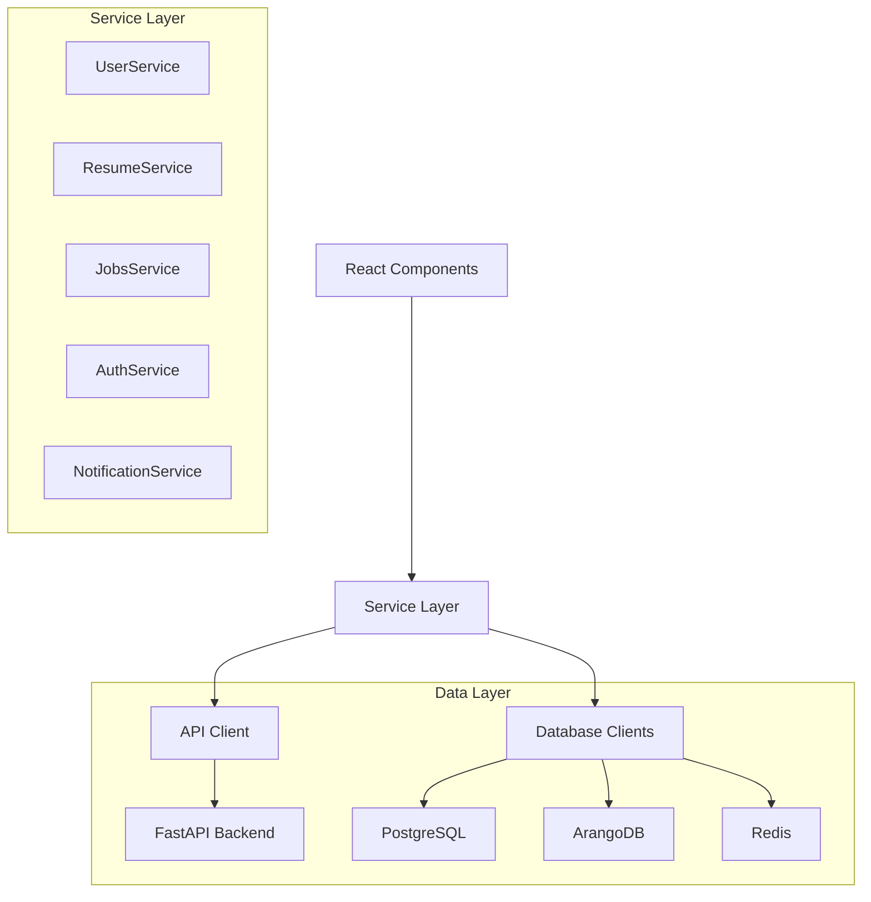

# ATSPro Service Architecture

## Overview

The ATSPro web application implements a service-oriented architecture with clear separation between data access, business logic, and presentation layers. Services abstract database interactions and provide a consistent API for components.

## Service Layer Architecture



## Service Interfaces

### Core Service Types

```typescript
// Base service interface
interface BaseService {
  isInitialized: boolean;
  initialize(): Promise<void>;
  destroy(): Promise<void>;
}

// API response wrapper
interface ApiResponse<T> {
  data: T;
  success: boolean;
  message?: string;
  errors?: string[];
}

// Pagination interface
interface PaginatedResponse<T> {
  data: T[];
  total: number;
  page: number;
  page_size: number;
  has_next: boolean;
  has_previous: boolean;
}

// Database entities with metadata
interface BaseEntity {
  id: string;
  created_at: string;
  updated_at: string;
}
```

### UserService Interface

```typescript
// Better-Auth user type (from better-auth)
interface BetterAuthUser {
  id: string;
  name: string;
  email: string;
  emailVerified: boolean;
  image?: string;
  createdAt: Date;
  updatedAt: Date;
}

// Extended user profile information
interface UserProfile extends BaseEntity {
  user_id: string; // References better-auth user.id
  phone?: string;
  location?: string;
  title?: string;
  bio?: string;
}

// Combined user data
interface FullUserProfile {
  user: BetterAuthUser;
  profile?: UserProfile;
}

interface UserSettings extends BaseEntity {
  user_id: string;
  theme: 'light' | 'dark' | 'system';
  notifications: {
    email: boolean;
    push: boolean;
    sms: boolean;
  };
  preferences: {
    auto_optimize: boolean;
    save_drafts: boolean;
    default_privacy: 'public' | 'private';
  };
}

interface Subscription extends BaseEntity {
  user_id: string;
  plan: 'free' | 'premium' | 'enterprise';
  status: 'active' | 'inactive' | 'cancelled' | 'expired';
  starts_at: string;
  ends_at?: string;
  auto_renew: boolean;
  stripe_subscription_id?: string;
}

interface UserService extends BaseService {
  // Profile Management (works with better-auth user + extended profile)
  getFullProfile(): Promise<ApiResponse<FullUserProfile>>;
  getProfile(): Promise<ApiResponse<UserProfile>>;
  updateProfile(profile: Partial<UserProfile>): Promise<ApiResponse<UserProfile>>;
  deleteProfile(): Promise<ApiResponse<void>>;

  // Settings Management
  getSettings(): Promise<ApiResponse<UserSettings>>;
  updateSettings(settings: Partial<UserSettings>): Promise<ApiResponse<UserSettings>>;

  // Subscription Management
  getSubscription(): Promise<ApiResponse<Subscription>>;
  updateSubscription(plan: string): Promise<ApiResponse<Subscription>>;
  cancelSubscription(): Promise<ApiResponse<void>>;

  // Better-Auth Integration (delegated to AuthService)
  getCurrentUser(): Promise<ApiResponse<BetterAuthUser | null>>;
  updateUserName(name: string): Promise<ApiResponse<BetterAuthUser>>;
  updateUserEmail(email: string): Promise<ApiResponse<BetterAuthUser>>;
}
```

### ResumeService Interface

```typescript
interface ResumeVersion extends BaseEntity {
  user_id: string; // References better-auth user.id
  version: number;
  is_active: boolean;
  resume_data: Resume;
}

interface OptimizationResult extends BaseEntity {
  resume_id: string;
  job_id: string;
  user_id: string; // References better-auth user.id
  content: string;
  optimization_score: number;
  keywords_matched: string[];
  suggestions: string[];
}

interface ResumeService extends BaseService {
  // Resume Management
  getResume(): Promise<ApiResponse<ResumeVersion>>;
  updateResume(resumeData: Resume): Promise<ApiResponse<ResumeVersion>>;
  createResume(resumeData: Resume): Promise<ApiResponse<ResumeVersion>>;
  deleteResume(): Promise<ApiResponse<void>>;

  // Version Management
  getVersions(): Promise<ApiResponse<ResumeVersion[]>>;
  restoreVersion(version: number): Promise<ApiResponse<ResumeVersion>>;

  // File Operations
  uploadResume(file: File): Promise<ApiResponse<Resume>>;
  exportResume(format: 'pdf' | 'docx' | 'txt'): Promise<ApiResponse<Blob>>;

  // Optimization
  optimizeForJob(jobId: string): Promise<ApiResponse<OptimizationResult>>;
  getOptimizations(): Promise<ApiResponse<OptimizationResult[]>>;
  getOptimization(id: string): Promise<ApiResponse<OptimizationResult>>;

  // Analytics
  getResumeAnalytics(): Promise<ApiResponse<{
    total_optimizations: number;
    avg_score: number;
    top_skills: string[];
    optimization_history: Array<{date: string; score: number}>;
  }>>;
}
```

### JobsService Interface

```typescript
interface JobStatus {
  status: 'saved' | 'applied' | 'interviewing' | 'rejected' | 'offered';
  application_date?: string;
  notes?: string;
}

interface JobEntity extends BaseEntity {
  user_id: string; // References better-auth user.id
  title: string;
  company: string;
  job_details: Job;
  status_info: JobStatus;
}

interface JobDocument extends BaseEntity {
  job_id: string;
  user_id: string; // References better-auth user.id
  type: 'resume' | 'cover_letter' | 'portfolio';
  filename: string;
  content?: string;
  file_url?: string;
}

interface JobsService extends BaseService {
  // Job Management
  listJobs(params?: {
    status?: string;
    company?: string;
    page?: number;
    page_size?: number;
  }): Promise<ApiResponse<PaginatedResponse<JobEntity>>>;
  
  getJob(id: string): Promise<ApiResponse<JobEntity>>;
  createJob(jobUrl: string): Promise<ApiResponse<JobEntity>>;
  updateJob(id: string, updates: Partial<JobEntity>): Promise<ApiResponse<JobEntity>>;
  deleteJob(id: string): Promise<ApiResponse<void>>;

  // Job Status Management
  updateStatus(id: string, status: JobStatus): Promise<ApiResponse<JobEntity>>;
  bulkUpdateStatus(jobIds: string[], status: JobStatus): Promise<ApiResponse<void>>;

  // Document Management
  getDocuments(jobId: string): Promise<ApiResponse<JobDocument[]>>;
  uploadDocument(jobId: string, file: File, type: JobDocument['type']): Promise<ApiResponse<JobDocument>>;
  createDocument(jobId: string, content: string, type: JobDocument['type']): Promise<ApiResponse<JobDocument>>;
  deleteDocument(documentId: string): Promise<ApiResponse<void>>;

  // Job Analysis
  analyzeJob(jobUrl: string): Promise<ApiResponse<Job>>;
  getJobInsights(id: string): Promise<ApiResponse<{
    skill_match: number;
    experience_match: number;
    missing_skills: string[];
    recommendations: string[];
  }>>;

  // Search & Filtering
  searchJobs(query: string): Promise<ApiResponse<JobEntity[]>>;
  filterJobs(filters: {
    status?: string[];
    company?: string[];
    location?: string[];
    salary_range?: [number, number];
    date_range?: [string, string];
  }): Promise<ApiResponse<JobEntity[]>>;
}
```

### AuthService Interface

```typescript
// Better-Auth session type
interface BetterAuthSession {
  user: BetterAuthUser;
  session: {
    id: string;
    userId: string;
    expiresAt: Date;
    token: string;
    ipAddress?: string;
    userAgent?: string;
  };
}

interface AuthService extends BaseService {
  // Authentication (delegates to better-auth)
  signIn(email: string, password: string): Promise<ApiResponse<BetterAuthSession>>;
  signUp(email: string, password: string, name: string): Promise<ApiResponse<BetterAuthUser>>;
  signOut(): Promise<ApiResponse<void>>;

  // Session Management (delegates to better-auth)
  getSession(): Promise<ApiResponse<BetterAuthSession | null>>;
  validateSession(): Promise<boolean>;

  // User Management (delegates to better-auth)
  getCurrentUser(): Promise<ApiResponse<BetterAuthUser | null>>;
  updateUser(data: { name?: string; email?: string }): Promise<ApiResponse<BetterAuthUser>>;
  deleteAccount(): Promise<ApiResponse<void>>;

  // Email Verification (delegates to better-auth)
  sendVerificationEmail(): Promise<ApiResponse<void>>;
  verifyEmail(token: string): Promise<ApiResponse<void>>;

  // Password Management (delegates to better-auth)
  changePassword(currentPassword: string, newPassword: string): Promise<ApiResponse<void>>;
  requestPasswordReset(email: string): Promise<ApiResponse<void>>;
  confirmPasswordReset(token: string, newPassword: string): Promise<ApiResponse<void>>;

  // Better-Auth Client Access
  getBetterAuthClient(): typeof import('better-auth/client');
}
```

### NotificationService Interface

```typescript
interface Notification extends BaseEntity {
  user_id: string; // References better-auth user.id
  title: string;
  message: string;
  type: 'info' | 'success' | 'warning' | 'error';
  category: 'system' | 'optimization' | 'job' | 'subscription';
  is_read: boolean;
  action_url?: string;
}

interface NotificationPreferences {
  email_notifications: boolean;
  push_notifications: boolean;
  categories: {
    system: boolean;
    optimization: boolean;
    job_updates: boolean;
    subscription: boolean;
  };
}

interface NotificationService extends BaseService {
  // Notification Management
  getNotifications(params?: {
    is_read?: boolean;
    category?: string;
    page?: number;
    page_size?: number;
  }): Promise<ApiResponse<PaginatedResponse<Notification>>>;

  markAsRead(id: string): Promise<ApiResponse<void>>;
  markAllAsRead(): Promise<ApiResponse<void>>;
  deleteNotification(id: string): Promise<ApiResponse<void>>;

  // Real-time Notifications
  subscribe(): Promise<void>;
  unsubscribe(): Promise<void>;

  // Preferences
  getPreferences(): Promise<ApiResponse<NotificationPreferences>>;
  updatePreferences(preferences: Partial<NotificationPreferences>): Promise<ApiResponse<NotificationPreferences>>;

  // Push Notifications
  requestPushPermission(): Promise<boolean>;
  subscribeToPush(): Promise<ApiResponse<void>>;
  unsubscribeFromPush(): Promise<ApiResponse<void>>;
}
```

## Service Implementation Pattern

### Base Service Class

```typescript
abstract class BaseServiceImpl implements BaseService {
  protected apiClient: ApiClient;
  protected cache: Map<string, any>;
  public isInitialized = false;

  constructor(apiClient: ApiClient) {
    this.apiClient = apiClient;
    this.cache = new Map();
  }

  async initialize(): Promise<void> {
    if (this.isInitialized) return;
    await this.onInitialize();
    this.isInitialized = true;
  }

  async destroy(): Promise<void> {
    if (!this.isInitialized) return;
    await this.onDestroy();
    this.cache.clear();
    this.isInitialized = false;
  }

  protected abstract onInitialize(): Promise<void>;
  protected abstract onDestroy(): Promise<void>;

  protected getCacheKey(method: string, ...args: any[]): string {
    return `${method}:${JSON.stringify(args)}`;
  }

  protected setCache<T>(key: string, value: T, ttl = 300000): void {
    this.cache.set(key, { value, expires: Date.now() + ttl });
  }

  protected getCache<T>(key: string): T | null {
    const cached = this.cache.get(key);
    if (!cached) return null;
    
    if (Date.now() > cached.expires) {
      this.cache.delete(key);
      return null;
    }
    
    return cached.value;
  }

  protected async withCache<T>(
    key: string,
    fetcher: () => Promise<T>,
    ttl = 300000
  ): Promise<T> {
    const cached = this.getCache<T>(key);
    if (cached) return cached;

    const result = await fetcher();
    this.setCache(key, result, ttl);
    return result;
  }
}
```

### API Client Integration

```typescript
interface ApiClient {
  get<T>(url: string, config?: RequestConfig): Promise<ApiResponse<T>>;
  post<T>(url: string, data?: any, config?: RequestConfig): Promise<ApiResponse<T>>;
  put<T>(url: string, data?: any, config?: RequestConfig): Promise<ApiResponse<T>>;
  patch<T>(url: string, data?: any, config?: RequestConfig): Promise<ApiResponse<T>>;
  delete<T>(url: string, config?: RequestConfig): Promise<ApiResponse<T>>;
  upload<T>(url: string, file: File, config?: RequestConfig): Promise<ApiResponse<T>>;
}

interface RequestConfig {
  headers?: Record<string, string>;
  timeout?: number;
  retries?: number;
  cache?: boolean;
}

class ApiClientImpl implements ApiClient {
  private baseURL: string;
  private defaultHeaders: Record<string, string>;

  constructor(baseURL: string) {
    this.baseURL = baseURL;
    this.defaultHeaders = {
      'Content-Type': 'application/json'
    };
  }

  async get<T>(url: string, config?: RequestConfig): Promise<ApiResponse<T>> {
    return this.request<T>('GET', url, null, config);
  }

  async post<T>(url: string, data?: any, config?: RequestConfig): Promise<ApiResponse<T>> {
    return this.request<T>('POST', url, data, config);
  }

  async put<T>(url: string, data?: any, config?: RequestConfig): Promise<ApiResponse<T>> {
    return this.request<T>('PUT', url, data, config);
  }

  async patch<T>(url: string, data?: any, config?: RequestConfig): Promise<ApiResponse<T>> {
    return this.request<T>('PATCH', url, data, config);
  }

  async delete<T>(url: string, config?: RequestConfig): Promise<ApiResponse<T>> {
    return this.request<T>('DELETE', url, null, config);
  }

  async upload<T>(url: string, file: File, config?: RequestConfig): Promise<ApiResponse<T>> {
    const formData = new FormData();
    formData.append('file', file);
    
    return this.request<T>('POST', url, formData, {
      ...config,
      headers: {
        ...config?.headers,
        // Remove Content-Type to let browser set it with boundary
      }
    });
  }

  private async request<T>(
    method: string,
    url: string,
    data?: any,
    config?: RequestConfig
  ): Promise<ApiResponse<T>> {
    const fullUrl = `${this.baseURL}${url}`;
    const headers = { ...this.defaultHeaders, ...config?.headers };
    
    // Remove Content-Type for FormData
    if (data instanceof FormData) {
      delete headers['Content-Type'];
    }

    try {
      const response = await fetch(fullUrl, {
        method,
        headers,
        body: data instanceof FormData ? data : JSON.stringify(data),
        signal: config?.timeout ? AbortSignal.timeout(config.timeout) : undefined
      });

      const result = await response.json();

      return {
        data: result.data || result,
        success: response.ok,
        message: result.message,
        errors: result.errors
      };
    } catch (error) {
      return {
        data: null as T,
        success: false,
        message: error instanceof Error ? error.message : 'Unknown error occurred',
        errors: [error instanceof Error ? error.message : 'Unknown error']
      };
    }
  }
}
```

## Error Handling & Validation

### Service Error Types

```typescript
enum ServiceErrorType {
  NETWORK_ERROR = 'NETWORK_ERROR',
  VALIDATION_ERROR = 'VALIDATION_ERROR',
  AUTHENTICATION_ERROR = 'AUTHENTICATION_ERROR',
  AUTHORIZATION_ERROR = 'AUTHORIZATION_ERROR',
  NOT_FOUND = 'NOT_FOUND',
  SERVER_ERROR = 'SERVER_ERROR',
  TIMEOUT_ERROR = 'TIMEOUT_ERROR',
  CACHE_ERROR = 'CACHE_ERROR'
}

class ServiceError extends Error {
  public type: ServiceErrorType;
  public code: string;
  public details?: any;

  constructor(type: ServiceErrorType, message: string, code: string, details?: any) {
    super(message);
    this.type = type;
    this.code = code;
    this.details = details;
    this.name = 'ServiceError';
  }
}

// Error handling wrapper
async function handleServiceCall<T>(
  operation: () => Promise<ApiResponse<T>>
): Promise<T> {
  try {
    const response = await operation();
    
    if (!response.success) {
      throw new ServiceError(
        ServiceErrorType.SERVER_ERROR,
        response.message || 'Operation failed',
        'OPERATION_FAILED',
        response.errors
      );
    }
    
    return response.data;
  } catch (error) {
    if (error instanceof ServiceError) {
      throw error;
    }
    
    if (error instanceof Error) {
      throw new ServiceError(
        ServiceErrorType.NETWORK_ERROR,
        error.message,
        'NETWORK_ERROR'
      );
    }
    
    throw new ServiceError(
      ServiceErrorType.SERVER_ERROR,
      'Unknown error occurred',
      'UNKNOWN_ERROR'
    );
  }
}
```

## Service Factory & Dependency Injection

```typescript
interface ServiceContainer {
  userService: UserService;
  resumeService: ResumeService;
  jobsService: JobsService;
  authService: AuthService;
  notificationService: NotificationService;
}

class ServiceFactory {
  private static instance: ServiceFactory;
  private services: Partial<ServiceContainer> = {};
  private apiClient: ApiClient;

  private constructor() {
    this.apiClient = new ApiClientImpl(process.env.NEXT_PUBLIC_API_URL || 'http://localhost:8000');
  }

  static getInstance(): ServiceFactory {
    if (!ServiceFactory.instance) {
      ServiceFactory.instance = new ServiceFactory();
    }
    return ServiceFactory.instance;
  }

  async initializeServices(): Promise<ServiceContainer> {
    // Initialize services with dependencies
    this.services.authService = new AuthServiceImpl(this.apiClient);
    this.services.userService = new UserServiceImpl(this.apiClient, this.services.authService);
    this.services.resumeService = new ResumeServiceImpl(this.apiClient, this.services.authService);
    this.services.jobsService = new JobsServiceImpl(this.apiClient, this.services.authService);
    this.services.notificationService = new NotificationServiceImpl(this.apiClient, this.services.authService);

    // Initialize all services
    await Promise.all([
      this.services.authService.initialize(),
      this.services.userService.initialize(),
      this.services.resumeService.initialize(),
      this.services.jobsService.initialize(),
      this.services.notificationService.initialize()
    ]);

    return this.services as ServiceContainer;
  }

  getServices(): ServiceContainer {
    if (!this.isInitialized()) {
      throw new Error('Services not initialized. Call initializeServices() first.');
    }
    return this.services as ServiceContainer;
  }

  private isInitialized(): boolean {
    return !!(
      this.services.authService &&
      this.services.userService &&
      this.services.resumeService &&
      this.services.jobsService &&
      this.services.notificationService
    );
  }
}

// React hook for service access
export function useServices(): ServiceContainer {
  return ServiceFactory.getInstance().getServices();
}
```

## Implementation Guidelines

### Service Development Best Practices

1. **Single Responsibility**: Each service handles one domain
2. **Interface Segregation**: Split large interfaces into focused contracts
3. **Dependency Injection**: Services receive dependencies through constructor
4. **Error Handling**: Consistent error types and handling patterns
5. **Caching**: Implement appropriate caching strategies
6. **Type Safety**: Full TypeScript coverage with strict typing
7. **Testing**: Unit tests for all service methods
8. **Documentation**: JSDoc comments for all public methods

### Performance Considerations

1. **Caching Strategy**: Cache frequently accessed data with appropriate TTL
2. **Request Batching**: Batch multiple API calls where possible
3. **Lazy Loading**: Initialize services only when needed
4. **Memory Management**: Clear caches and subscriptions on destroy
5. **Connection Pooling**: Reuse HTTP connections for better performance

### Security Guidelines

1. **Authentication**: All API calls include valid authentication tokens
2. **Input Validation**: Validate all input data before API calls
3. **Error Information**: Don't expose sensitive information in errors
4. **Token Management**: Secure storage and refresh of auth tokens
5. **HTTPS Only**: All API communication over HTTPS in production